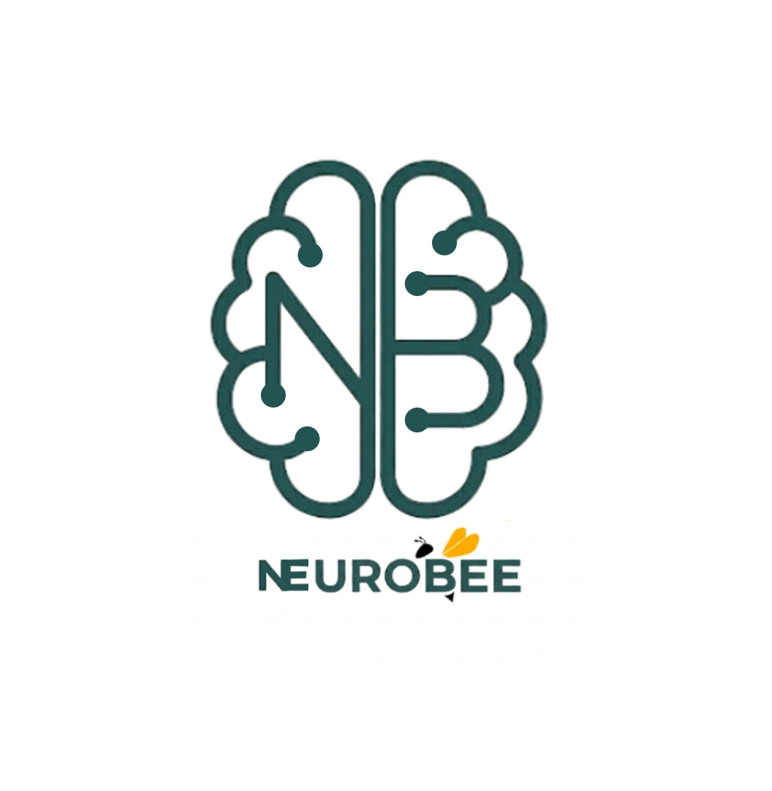

<p align="center">
  
</p>

<h1 align="center">NeuroBee</h1>

<p align="center">
  <strong>Early developmental awareness for every Indian family.</strong>
</p>

<p align="center">
  <em>Free · Private · Built for India</em>
</p>

<p align="center">
  <a href="#features">Features</a> ·
  <a href="#clinical-foundations">Clinical Foundations</a> ·
  <a href="#architecture">Architecture</a> ·
  <a href="#getting-started">Getting Started</a> ·
  <a href="#deployment">Deployment</a> ·
  <a href="#license">License</a>
</p>

---

## The Problem

**1 in every 68 children** in India shows signs of a neurodevelopmental difference — yet most families wait **years** before a concern is ever recognised. Access to early screening is limited by geography, language, cost, and stigma.

NeuroBee changes that. It is a **free, private, clinically-grounded** progressive web application that gives parents a clear picture of their child's early development — directly from their phone, in their own language, with no data ever leaving the device.

---

## Features

### 🧩 M-CHAT-R Aligned Questionnaire
- **20 evidence-based questions** across 6 developmental domains: Social Communication, Joint Attention, Imitation & Play, Language, Motor Development, and Sensory & Behaviour.
- Each question includes a **"Why it matters"** explanation to help parents understand what they're observing.
- **6 key indicators** (critical M-CHAT-R items) are flagged and weighted in risk calculation.
- Auto-save after every response — parents resume exactly where they left off.

### 👁️ Guided Behavioural Observation
- **6 structured real-world scenarios** (e.g. name response, joint attention, pointing) with precise instructions — where to stand, how many attempts, and what to watch for.
- Observation scores are **fused with questionnaire results** into a single developmental profile using evidence-based weighting.

### 📷 Camera-Based Gaze Screening *(Optional)*
- Uses the device's front-facing camera and **MediaPipe Face Landmarker** to analyse three gaze behaviours in real-time:
  1. **Eye Contact** — Social Communication
  2. **Name Response** — Joint Attention
  3. **Gaze Following** — Attention Regulation
- All processing happens **entirely on-device** — no video is uploaded or stored.

### 🤖 AI-Powered Personalised Insights
- Calls a **locally-running Gemma 4** language model (via LM Studio / Ollama) to generate personalised, compassionate insights.
- Every AI output references the **child's specific responses** — never generic.
- Falls back to **rule-based insights** automatically if no local LLM is available.
- Uses careful, non-diagnostic language: *"may benefit from"*, *"worth discussing with your paediatrician"*, *"showing patterns of"*.

### 🏥 Curated Referral Network
- **State-wise resource directory** across India — government RBSK centres, NGOs, helplines, and private clinical networks.
- Referral cards include:
  - A **"What to say" script** for calling — so no parent feels lost.
  - A **"Documents to bring" checklist** — Aadhaar, immunisation records, prior reports.
- Resources filtered by the child's risk level.

### 📄 Professional PDF Reports
- Exportable developmental report designed to be **handed directly to a paediatrician**.
- Includes screening scores, domain breakdown, risk classification, session history, and clinical framework references.

### 🌐 Bilingual Support (English + Hindi)
- Full localisation of every screen, question, AI insight, and referral script.
- Language can be switched instantly at any time from the profile page.

### 🔒 100% Privacy-First
- **Zero accounts. Zero servers. Zero cloud.** All data is stored locally on the device via `localStorage`.
- The optional reset button permanently erases everything.
- Installable as a **Progressive Web App (PWA)** with offline support via service worker.

---

## Clinical Foundations

NeuroBee's screening methodology is grounded in three established clinical frameworks:

| Framework | Authority | Usage in NeuroBee |
|-----------|-----------|-------------------|
| **M-CHAT-R** (Modified Checklist for Autism in Toddlers, Revised) | Indian Academy of Pediatrics (IAP) | Core questionnaire structure, critical item flagging, risk scoring |
| **RBSK** (Rashtriya Bal Swasthya Karyakram) | National Health Mission, Govt. of India | Referral pathways, government centre directory |
| **NIMHANS Guidelines** | National Institute of Mental Health and Neurosciences | Neurodevelopmental screening protocols, observation domains |

> [!IMPORTANT]
> NeuroBee is a **parent observation aid**. It does **not** provide clinical diagnosis. Results should always be discussed with a qualified paediatrician or developmental specialist.

---

## Architecture

```
neurobee/
├── public/
│   ├── mediapipe/          # MediaPipe WASM binaries (copied at install)
│   ├── sw.js               # Service worker for offline PWA support
│   └── manifest.json       # PWA manifest
├── scripts/
│   ├── copy-mediapipe-wasm.js  # Postinstall script for WASM assets
│   └── test-classifier.mjs    # Classifier accuracy testing
├── src/
│   ├── app/
│   │   ├── page.tsx            # Home dashboard
│   │   ├── milestones/         # M-CHAT-R questionnaire flow
│   │   ├── observe/            # Guided behavioural observation
│   │   ├── screen/             # Camera-based gaze screening
│   │   ├── insights/           # AI-powered developmental insights
│   │   ├── referrals/          # State-wise referral directory
│   │   ├── profile/            # Parent workspace, PDF export, settings
│   │   └── api/
│   │       ├── insights/       # LLM proxy (Gemma 4 via LM Studio)
│   │       ├── daily-tip/      # Contextual daily tips
│   │       └── lmstudio-status/# LLM availability health check
│   ├── components/
│   │   ├── OnboardingScreen.tsx # 3-step first-run onboarding
│   │   ├── TopBar.tsx          # Persistent navigation header
│   │   ├── BottomNav.tsx       # Mobile bottom navigation
│   │   ├── SessionTimeline.tsx # Assessment history timeline
│   │   └── ...
│   ├── context/
│   │   ├── AppContext.tsx      # Global app state (language, responses, scores)
│   │   └── ProfileContext.tsx  # User profile management
│   └── lib/
│       ├── questions.ts        # M-CHAT-R question bank (EN + HI)
│       ├── observations.ts     # Observation scenario definitions
│       ├── screening-classifier.ts  # ML-style risk classifier
│       ├── screening-features.ts    # Feature extraction pipeline
│       ├── fusion.ts           # Multi-source score fusion engine
│       ├── gaze.ts             # MediaPipe gaze analysis pipeline
│       ├── referrals.ts        # India-wide referral database
│       ├── pdf.ts              # PDF report generator (jsPDF)
│       ├── sessions.ts         # Session persistence layer
│       ├── storage.ts          # LocalStorage abstraction
│       ├── profile.ts          # Profile utilities
│       └── i18n/               # Localisation (English + Hindi)
│           ├── en.ts
│           ├── hi.ts
│           ├── index.ts
│           └── types.ts
└── docs/
    ├── hybrid_deployment_strategy.md
    └── market_research_upgrades.md
```

### Tech Stack

| Layer | Technology |
|-------|-----------|
| **Framework** | [Next.js 16](https://nextjs.org/) (App Router) |
| **Language** | TypeScript 5 |
| **UI** | React 19, Tailwind CSS 4, Material Symbols |
| **Fonts** | Plus Jakarta Sans (headings), Inter (body) |
| **Computer Vision** | [MediaPipe Face Landmarker](https://ai.google.dev/edge/mediapipe/solutions/vision/face_landmarker) (WASM) |
| **AI / LLM** | Gemma 4 via local inference (LM Studio / Ollama) |
| **PDF Generation** | jsPDF + jspdf-autotable |
| **Data Storage** | Client-side `localStorage` (zero backend) |
| **PWA** | Custom service worker, web app manifest |

---

## Getting Started

### Prerequisites

- **Node.js** ≥ 18
- **npm** ≥ 9
- *(Optional)* [LM Studio](https://lmstudio.ai/) or [Ollama](https://ollama.com/) with a Gemma 4 model for AI insights

### Installation

```bash
# Clone the repository
git clone https://github.com/your-username/neurobee.git
cd neurobee

# Install dependencies (also copies MediaPipe WASM binaries to /public)
npm install

# Start the development server
npm run dev
```

Open [http://localhost:3000](http://localhost:3000) to view the app.

### Local AI Setup *(Optional)*

To enable personalised AI insights, run a local Gemma model:

**Option A — LM Studio:**
1. Download and install [LM Studio](https://lmstudio.ai/)
2. Load a Gemma 4 model (e.g. `gemma-4-e4b`)
3. Start the local server on the default port
4. NeuroBee will detect it automatically via the `/api/lmstudio-status` endpoint

**Option B — Ollama:**
1. Install [Ollama](https://ollama.com/)
2. Pull the model: `ollama pull gemma3`
3. The app will connect to Ollama's local API

> [!NOTE]
> If no local LLM is detected, NeuroBee **automatically falls back** to rule-based insights generated from the scoring engine — the app is fully functional without AI.

---

## Scripts

| Command | Description |
|---------|-------------|
| `npm run dev` | Start development server (accessible on LAN via `0.0.0.0`) |
| `npm run build` | Create production build |
| `npm run start` | Serve production build |
| `npm run lint` | Run ESLint |

---

## Deployment

### Vercel (Recommended)

The app is configured for seamless deployment on [Vercel](https://vercel.com/):

```bash
npx vercel
```

> [!NOTE]
> API routes (LLM proxy) require a server runtime. For a fully static export (e.g. GitHub Pages), uncomment `output: "export"` in `next.config.ts` — the app will use rule-based insights as the fallback.

### Static Export

```bash
# Uncomment `output: "export"` in next.config.ts, then:
npm run build
# Deploy the /out directory to any static host
```

---

## Roadmap

- [ ] Interactive video stimuli for screening tasks
- [ ] Asynchronous video upload for offline gaze analysis
- [ ] Additional language support (Tamil, Telugu, Bengali, Marathi)
- [ ] Longitudinal developmental tracking with trend visualisation
- [ ] Integration with ABDM (Ayushman Bharat Digital Mission) health records

---

## Contributing

Contributions are welcome! Whether it's clinical accuracy improvements, new language translations, accessibility enhancements, or bug fixes — every contribution helps reach more families.

1. Fork the repository
2. Create your feature branch (`git checkout -b feature/amazing-feature`)
3. Commit your changes (`git commit -m 'Add amazing feature'`)
4. Push to the branch (`git push origin feature/amazing-feature`)
5. Open a Pull Request

---

## Acknowledgements

- **[M-CHAT-R](https://mchatscreen.com/)** — Diana Robins, Deborah Fein, & Marianne Barton
- **[MediaPipe](https://ai.google.dev/edge/mediapipe)** — Google AI Edge
- **[Gemma](https://ai.google.dev/gemma)** — Google DeepMind
- **Indian Academy of Pediatrics (IAP)** — M-CHAT-R endorsement and Indian developmental guidelines
- **NIMHANS** — Neurodevelopmental screening protocols
- **National Health Mission (RBSK)** — Public health referral infrastructure

---

## License

This project is for educational and research purposes. Please contact the maintainers for licensing enquiries.

---

<p align="center">
  <sub>Built with 💛 for every Indian family navigating early childhood development.</sub>
</p>
